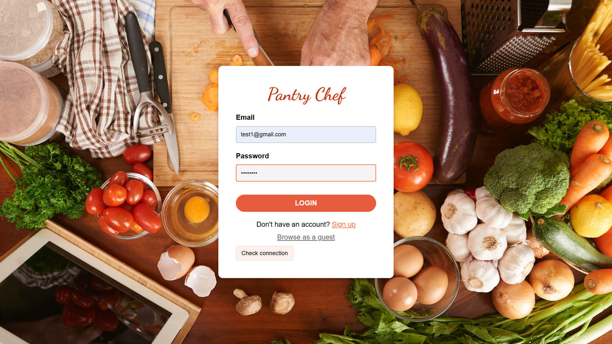
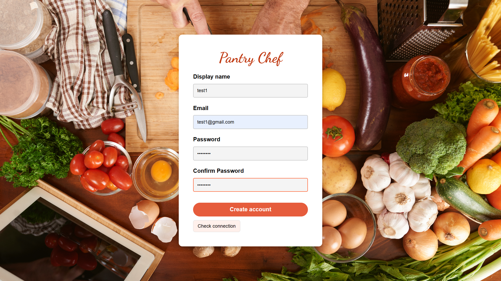
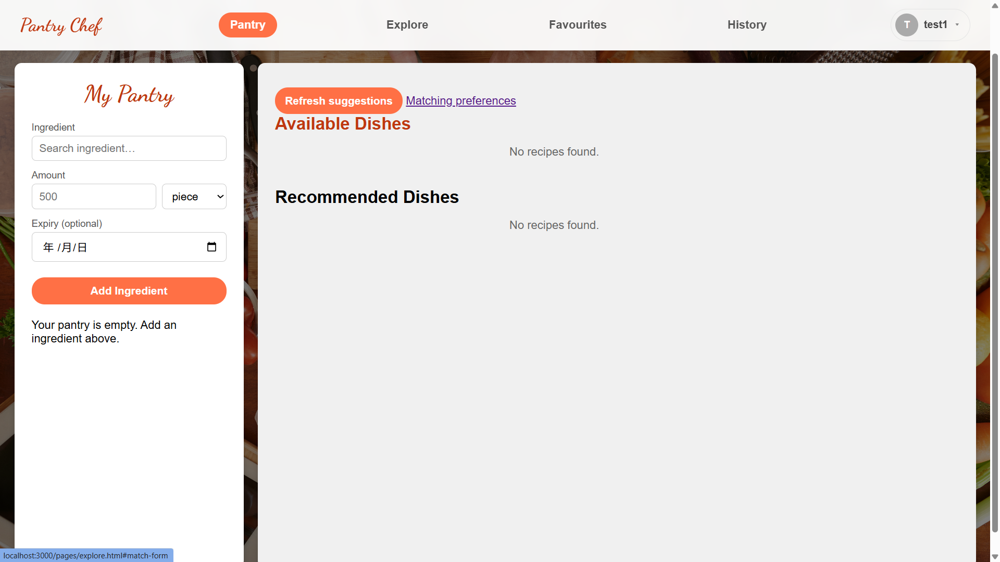
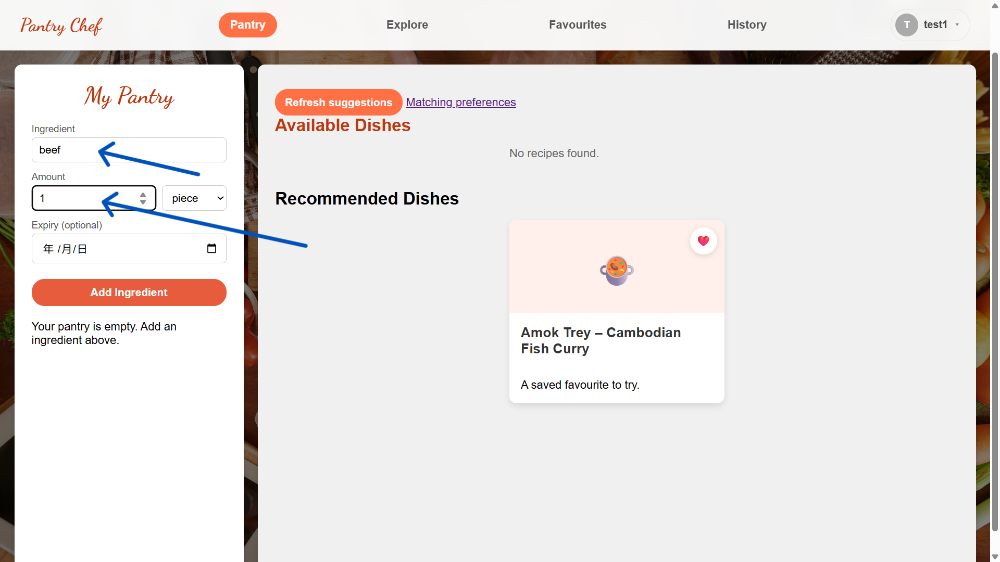
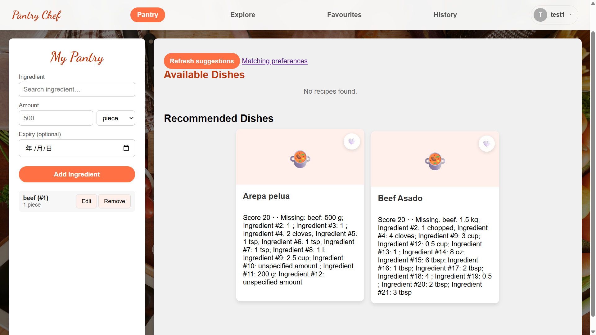
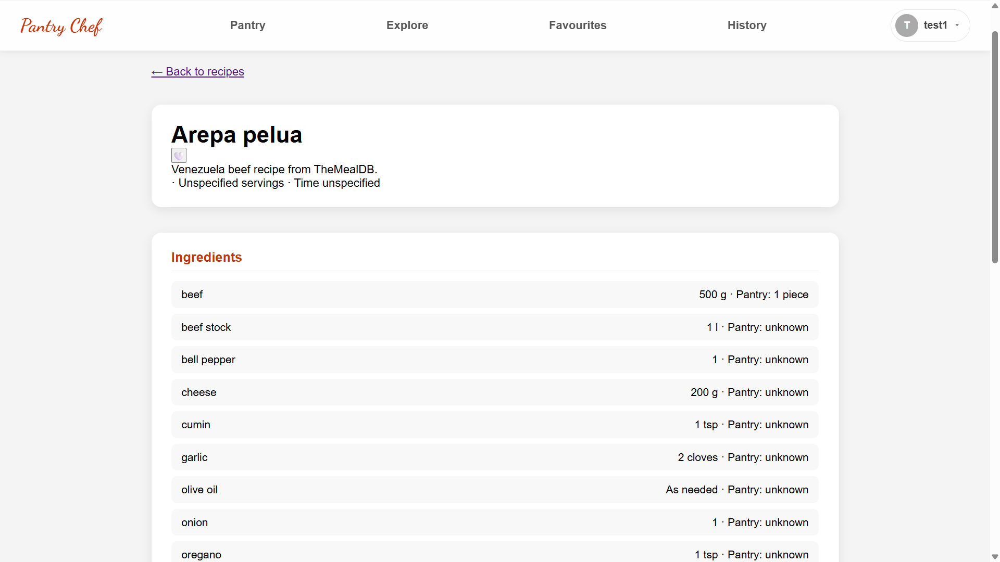
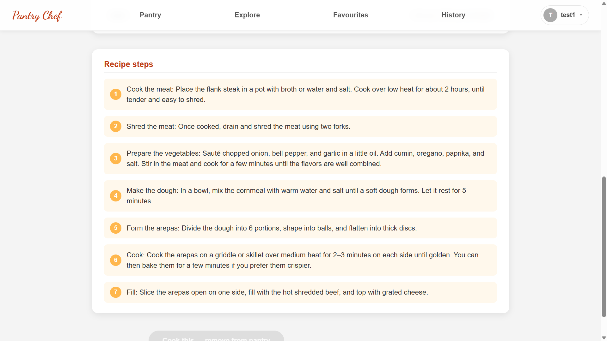
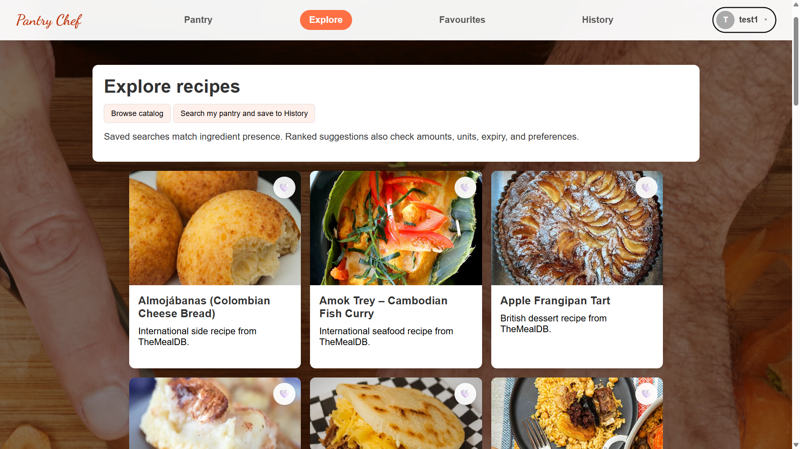
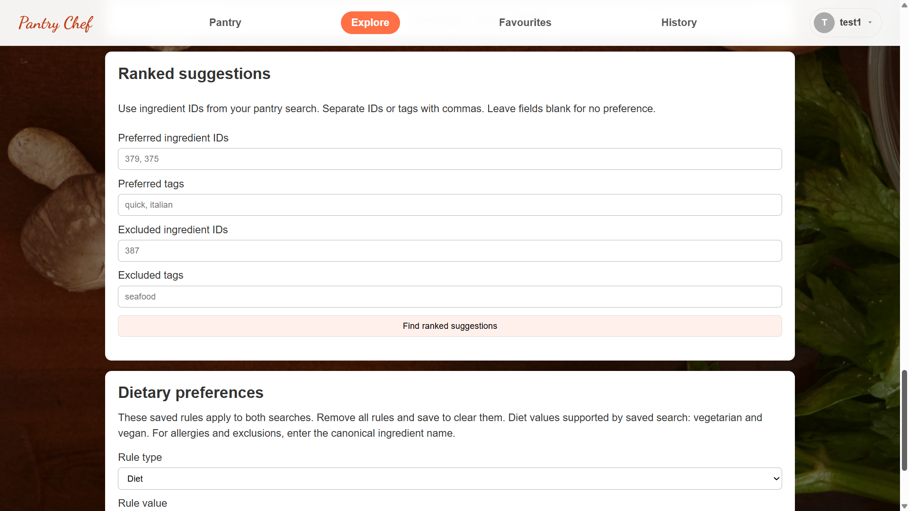
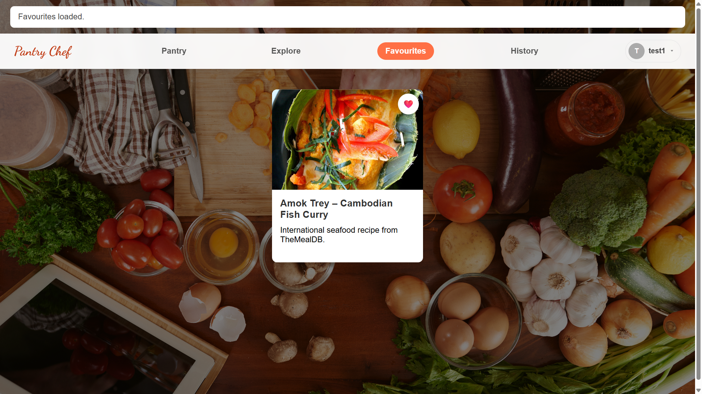

# PantryChef — Project Proposal

## Team members and preliminary task allocation

| Full name | Student number | Planned responsibilities |
| --- | --- | --- |
| Yuk Ki Ao | 3036452948 | ER diagram, ingredient matching and ranking, recipe data scraping, ingredient/tag generation, AI integration (future). |
| Li Yiting | 3036406119 | Backend architecture, REST API, MySQL integration, authentication, search, and Docker setup. |
| Ou Yang Bing | 3036393099 | UI/UX design, responsive frontend pages, and the React single-page application. |
| Esohe Osaghae | 3036718574 | Project proposal, frontend react migration and nice to have features, testing, technical doccumentation. |

## Project description

PantryChef is a responsive web application for students and busy households who want to decide what to cook with ingredients they already own. Users record their pantry ingredients and dietary preferences, browse or search a recipe catalog, and receive ranked suggestions that explain which ingredients they have and which are missing. They can read cooking steps, save favorites, revisit searches, and update their pantry after cooking. By making existing food easier to use, PantryChef aims to reduce meal-planning time and avoid forgotten ingredients and food waste.

## Problem and target user context

People often have food at home but cannot quickly see which meals it can make, especially when they have limited time, a dietary restriction, or only a few ingredients. Checking recipes one by one and comparing each ingredient list against the kitchen cupboard is tedious. PantryChef is designed for people making everyday meal decisions at home, including students with small pantries and busy households. A web application is suitable because it works in a browser on a phone while cooking and on a larger screen while planning, with a saved pantry and search history available across sessions. Allrecipes and SuperCook are reference points for recipe discovery; PantryChef focuses on connecting suggestions to a user's saved pantry.

## Feature list

### Must-have

1. **Accounts and sessions:** Register, sign in, sign out, and keep each user's pantry, preferences, favorites, and history private. Guests can browse the public recipe catalog and recipe details.
2. **Pantry management:** Add, view, edit, and remove ingredients with quantities, units, and optional expiry dates; find ingredients through catalog search and aliases.
3. **Recipe discovery and matching:** Browse recipes and request ranked suggestions based on pantry ingredients and selected preferences. Show available and missing ingredients so users can understand each match.
4. **Dietary preferences:** Save dietary rules and exclude recipes that conflict with selected restrictions when matching.
5. **Recipe details:** Show the ingredient list and ordered cooking instructions. Display servings, preparation time, cooking time, and difficulty when the source provides them; otherwise show that the information is unavailable.
6. **Cooking and pantry update:** Let a user confirm cooking a recipe and deduct the required ingredients that have known, compatible quantities from the pantry.
7. **Favorites and history:** Save or remove favorite recipes and reopen previous searches and results.
8. **Usable interface:** Provide responsive pages and basic client-side and server-side input validation, with clear loading, empty, and error feedback.

### Nice-to-have

1. AI-generated recipe suggestions, subject to choosing a provider and retaining the catalog as a fallback.
2. Expiry reminders or expiry-aware ranking.
3. A shopping list for missing ingredients.
4. Recipe ratings, comments, or a community sharing area.
5. Curated servings, time, and difficulty values for recipes whose source omits them.

Ingredient normalization, relational recipe data, saved user state, dietary filtering, and explainable ranking make the core more substantial than a basic create-read-update-delete application. Nice-to-have work will start only after all must-have features are complete.

## Full technology stack

| Layer | Selection and purpose |
| --- | --- |
| Frontend | React with Vite for a responsive single-page application; HTML, CSS, and browser JavaScript for the interface. The current page mockups and prototype are plain HTML/CSS/JavaScript and will be consolidated into the React SPA. |
| Backend | Node.js and Express, exposing a RESTful JSON API with appropriate HTTP status codes and input validation. Server-side sessions use cookies; passwords are hashed. |
| Database | MySQL 8.4 only, accessed through `mysql2` and Knex migrations. It stores accounts, sessions, pantry items, ingredients and aliases, recipes and steps, dietary rules, favorites, and search history. |
| Deployment | A Linux virtual machine running Docker Compose containers for MySQL, the Express API, and Nginx. Nginx serves the frontend and proxies API requests. Secrets are supplied through environment variables; `.env.example` documents required settings. |
| External data and services | TheMealDB official API is the source of the collected recipe dataset; source URLs and attribution are retained. The core application uses imported MySQL recipe data rather than requiring TheMealDB at request time. Google Fonts is used for interface typography. An AI provider has not been chosen because AI generation is optional. |

##  ER diagram (May be slightly different from final)

## High-level user workflow

1. A visitor opens PantryChef, browses public recipes as a guest, or goes to the sign-up or sign-in page to use personal features.
2. After signing in, the user opens "My Pantry", searches the ingredient catalog, and adds ingredients with amounts. They can edit or remove entries later.
3. On "Explore", the user can browse recipes, set dietary preferences, and ask PantryChef to match recipes against their pantry. The page shows ranked recipe cards and explains available and missing ingredients.
4. The user opens a recipe card to see its ingredients and ordered steps. They can save it as a favorite. After cooking, they can confirm a pantry update when the required quantities and units are known.
5. The user visits "Favorites" to reopen saved recipes or "History" to revisit earlier searches, then signs out when finished.

Login page: User can login as a guest or their personal account

Signup page: User can sign up their account by clicking the sign up link

Home page: Default home page of Pantry Chef

My pantry: User can input their ingredient and amounts into their pantry

Load recipes: The website will suggest recipes based on users' pantry

Recipe card: By clicking the name of the dish, users can see the details

Recipe card: The image, ingredients and steps will be shown

Explore page: Users can explore different recipes here

Preferences: Users can choose their diet type and preference

Favourite page: By clicking on the heart button, the card will be stored as Favourites

## Anticipated learning challenges and self-assessment

| Challenge and current starting point | Practical plan |
| --- | --- |
| **Converting ingredient quantities between units:** A pantry item may be recorded as “pieces” or “cans” while a recipe specifies grams. The weight of a piece or can varies by ingredient and package, so a universal conversion could produce inaccurate matches or pantry deductions. | Store verified ingredient-specific conversion values and let users enter a can’s labelled weight when needed. Convert only when the required information is available; otherwise show the quantity as uncertain and ask the user to confirm it before cooking. |
| **Improving the pantry-entry experience:** Users currently enter each ingredient's name and quantity manually, plus an expiry date if they want to track it. Repeating this for a full pantry takes time and invites mistakes. | Add ingredient autocomplete, a quick-add flow for multiple items, remembered units and quantities for common ingredients, and an optional expiry field. Let users review and edit entries before saving; explore photo or receipt text extraction later if the simpler flow is still too slow. |
| **Scaling recipe search and integrating optional AI:** More users and recipes can make matching queries slower. An AI service would add latency, rate limits, cost, and results that may suggest unavailable ingredients or conflict with dietary rules. | Benchmark matching with a larger recipe catalog, add appropriate database indexes and result limits, and keep catalog matching as the default. If AI is added, validate its suggestions against pantry and dietary data, limit requests, and fall back to catalog results when the service fails. |
